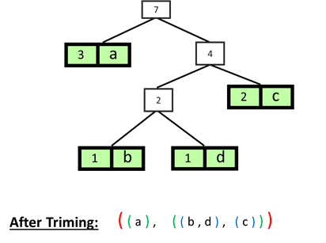

## Problem 1: LRU_Cache
I have used a doubly linked list as it provides O(1) runnig time for insert and delete  operation. The node contains key and value. The key of the node is used to get the value from the dictionary.  The cache is built with dictionary of keys so all its operations (get, set..) take **O(1)** running time.
> Running time is O(1)
Space Complexity is O(n)

## Problem 2: File recursion
File directory forms a tree like hierarchy. So I decided to use recursion for traversing the tree. It take exponential as we have to recur for every file in a directory.
>Here the time complexity is **O(2^n)**  and the space complexity is the maximum depth of recursion * space for each call O(nm). Here n is the maximum depth of recursion and m is the space for each recursive call.

## Problem 3: Huffman Code
Here I have abstracted the tree as python tuples. The design of the algorithm is given bellow:
### Steps
#### Build the tree
We have a list containing frequencies of character ordered in lowest to highest.

__Algorithm__:

We build a node for each char with its frequency. Its the frequency list (tuples list) in our case.
- We abstract the node and the tree as tuple.
- All the nodes are generally added to a priority queue or in our case in the sorted list of tuples.
- Generate trees with root being the sum of frequencies of the two least frequent character.
- Remove the two used characters from the tuple list. (or dequeue from the priority queue)
- Add the tree to the to tuples list and sort. (or in priority queue)
- Continue __(Loop)__ doing this until we have a one single tree i.e. the length of the tuple list becomes 1.

#### Trim Tree
Here we build a tuple containing the leaf from left to right.

#### Assign Codes
Build A dictionary of binary encoded codes for the characters.
We passed the trimmed tree as node

#### Encode
#### Decode

### Efficiency
Here iteration and traversing the tree takes **O(nlogn)** running time and space complexity is O(n) for the codes dictionary.

## Problem 4: Active Directory
In this problem we have a parent group and it can have other groups of users as its child forming a tree like structure. So I have used recursion the traverse the tree.
> In worst case it takes O(2^n) running time where n is the depth of the nested groups. Space complexity is O(nm) where n is the maximum depth of recursion and m is the space for each recursive call.

## Problem 5: BlockChain
Here we are linking blocks where each blocks contains a hash which is the location, its timestamp, and its data. The idea of the add operation is to keep track of a current block which kind of act as doubly linked list. Thus it increases the efficiency of adding a block in the chain.
>Adding to the block chain takes O(1) running time and printing takes O(n) running time. Space efficiency is O(n)

## Problem 6: Union and intersection of LinkedList
Here I have used a dictionary for keeping track of the values in linked list. Dictionary `in` operator provides O(1) runtime. For the result LinkedList it needs multiple iteration through the list. The runtime efficient of Union and Intersection is O(n) and space complexity is O(n) where n is the length of list and dictionary
